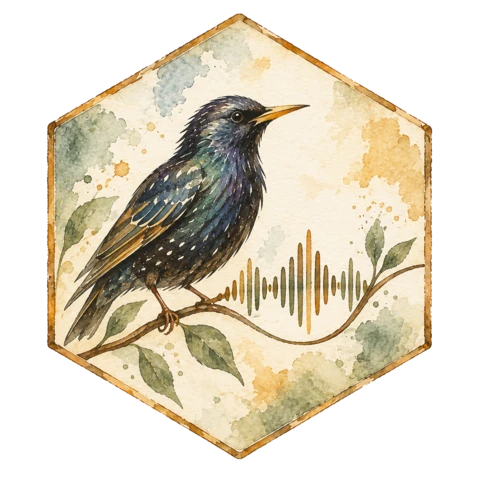

# Starling



Speech recognition that you can serve anywhere, with apps for desktop and phone.
Starling owns its inference engine: native ggml backends run GGUF models on CPU,
with optional Metal, Vulkan, HIP, or CUDA acceleration. No Python or NVIDIA GPU
is required for the main server or the apps.

This is a monorepo for the engine, serving API, quantization tools, shared
transcription contracts, and applications. The apps are development foundations;
see the [platform status](docs/monorepo.md) for what works and what still needs
native device testing.

<br clear="right">

## Run the server

Quickest path — Node.js 20+, no compiler and no GPU required:

```bash
npx starling-serve --model parakeet --gguf /path/to/model.gguf --port 8181
```

The launcher downloads the prebuilt binary for your platform on first run and
verifies its checksum; see [packaging](docs/packaging.md) for backend
selection and overrides.

To build from source instead, you need CMake, a C++17 compiler, Git, and Bash.
Initialize the submodule, build, and supply a compatible GGUF model from the
[model guide](docs/models.md):

```bash
git submodule update --init --recursive
cmake -B build -DSTARLING_SERVE=ON
cmake --build build -j --target starling-serve
./build/starling-serve --model parakeet --gguf /path/to/model.gguf --port 8181
```

The root CMake entry point remains supported. You can also configure the native
component directly with `cmake -S backends/native -B build/native -DSTARLING_SERVE=ON`,
or use `cmake --preset native-cpu` with CMake 3.21+ and Ninja.

Use the OpenAI-compatible batch transcription API:

```bash
curl http://127.0.0.1:8181/v1/audio/transcriptions \
  -F model=parakeet -F file=@recording.wav
```

The initial compatible subset accepts 16 kHz WAV and returns `{"text":"…"}`.
`GET /v1/models` lists the configured model. Unsupported features return errors;
read the [API contract](docs/api.md) before pointing a third-party client at it.
Live dictation uses Starling's `WS /stream` route.

## Run the apps

The desktop app is the native Rust build in `apps/desktop-gpui`:

```bash
cd apps/desktop-gpui
cargo run -p starling-gpui --release
```

Linux needs a Wayland or X11 session plus the usual audio and font
libraries; see [the app's README](apps/desktop-gpui/README.md) for
prerequisites, data locations, and the packaging script CI uses. CI builds
unsigned macOS and Windows artifacts on every push.

- [Desktop: Windows, Linux, macOS](apps/desktop-gpui/README.md)
- [Android recorder and voice keyboard](apps/mobile/README.md)
- [iOS recorder](apps/ios/README.md)

Recognition returns raw text. Apps retain recordings for review and retry;
copying or inserting a transcript is an explicit action. Vocabulary hints and
suggested edits must never silently replace the original. These rules protect
against destructive processing; they cannot guarantee ASR accuracy.

## Workspace

| Component | Location |
| --- | --- |
| Native server and engine build | [`backends/native/`](backends/native/) · engine source in `cpp/` |
| Quant recipes, catalog, artifact tooling | [`quants/`](quants/) |
| Desktop app (Rust, gpui) | [`apps/desktop-gpui/`](apps/desktop-gpui/) |
| Android app and voice keyboard | [`apps/mobile/`](apps/mobile/) |
| iOS app | [`apps/ios/`](apps/ios/) |
| Shared TypeScript client and fidelity rules | [`packages/dictation/`](packages/dictation/) |
| `starling-serve` npm launcher for prebuilt binaries | [`packages/serve/`](packages/serve/) |
| Language-independent API contract | [`packages/contracts/`](packages/contracts/) |
| Deprecated Python/CUDA serving | [`backends/python/`](backends/python/) · reference source in `src/starling/` |

The NVIDIA-only Python serving path is deprecated. Its kernels, benchmarks,
and existing commands remain for research and reproducibility. New app and
serving work targets the native engine and the portable HTTP contract.

## Documentation

[Architecture and platform status](docs/monorepo.md) · [API](docs/api.md) ·
[TypeScript development](docs/typescript.md) ·
[Models](docs/models.md) · [Native serving](docs/native-serving.md) ·
[Packaging and the npm launcher](docs/packaging.md) ·
[Quantization tools](quants/README.md) · [Quantization research](docs/quantization.md) ·
[Benchmarks](docs/benchmarks.md) · [Engine development](docs/ggml-engine.md)
