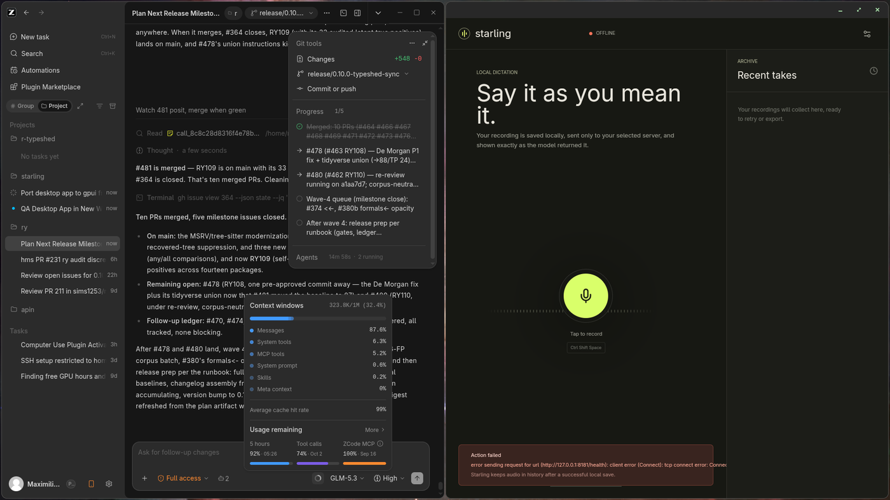

# Starling desktop — gpui port

Native Rust port of the Electron desktop app (`apps/desktop`), built with
[Zed's gpui](https://github.com/zed-industries/zed/tree/main/crates/gpui)
(crates.io `gpui 0.2.2`). Exists to compare look, feel, and performance against
the Electron version. See [COMPARISON.md](COMPARISON.md) for measurements and
[PORT.md](PORT.md) for the ported behavior contract and module map.



## Layout

- `crates/dictation` (`starling-dictation`) — logic + IO, no UI: WAV prep
  (PCM16 16 kHz mono, byte-faithful port of `@starling/dictation`'s audio
  module), the transcription HTTP client (starling + OpenAI protocols, mirrors
  the Electron native request path), a file-backed session store replacing
  IndexedDB (same manifest schema), settings persistence replacing
  `localStorage`, the fidelity analyzer, an FFT for the live waveform, cpal mic
  capture, and rodio playback. 81 unit tests.
- `crates/app` (`starling-gpui`) — the gpui app: topbar/connection indicator,
  capture pane with 52-bar waveform + record button, history column, transcript
  drawer with fidelity warnings, settings modal, in-app + global hotkeys,
  diagnostics hook.
- `GPUI_NOTES.md` — verified gpui 0.2.2 API cheat-sheet used to build the UI.

## Run

The machine's `rustup` shims misresolve argv[0] under some shells; invoke cargo
through the toolchain path if `cargo --version` errors:

```bash
export PATH="$HOME/.rustup/toolchains/stable-x86_64-unknown-linux-gnu/bin:$PATH"
cd apps/desktop-gpui

cargo run -p starling-gpui --release   # the app
cargo test -p starling-dictation       # logic tests
STARLING_DIAGNOSTICS=1 cargo run -p starling-gpui --release  # startup + RSS on first frame
```

Linux needs a Wayland or X11 session, Vulkan loader, fontconfig, and a
PipeWire/PulseAudio microphone source for recording — the same classes of
dependency the Electron app has.

Data locations (both created on demand):

- sessions: `~/.local/share/starling-gpui/sessions/<uuid>/{manifest.json,recording.wav}`
- settings: `~/.config/starling-gpui/settings.json`

The app talks to the same servers as the Electron app: a native
`starling-serve` (ggml) endpoint (`GET /health`, `POST /transcribe` with raw
`audio/wav`, `x-request-id` honored) or an OpenAI-compatible endpoint
(`GET /v1/models`, `POST /v1/audio/transcriptions` multipart). Start the
native server from a checkout with built binaries (the Python serving path is
deprecated):

```bash
build-cpu/starling-serve --model ark \
  --gguf models/ark-asr-0.6b-bf16-exact.gguf   # binds 127.0.0.1:8181
```

Verified end-to-end in this configuration: health flips the topbar to
`ark ready`, and `POST /transcribe` returns
`{text, segments: [{text, start_s, end_s}], duration_s, request_id}` —
the exact wire shape this client normalizes.

## Hotkeys

`Cmd/Ctrl+Shift+Space` toggles recording — focused (in-app action) and
system-wide (`global-hotkey`; on Wayland this is portal/compositor dependent
and degrades to a console warning, mirroring the Electron fallback).
