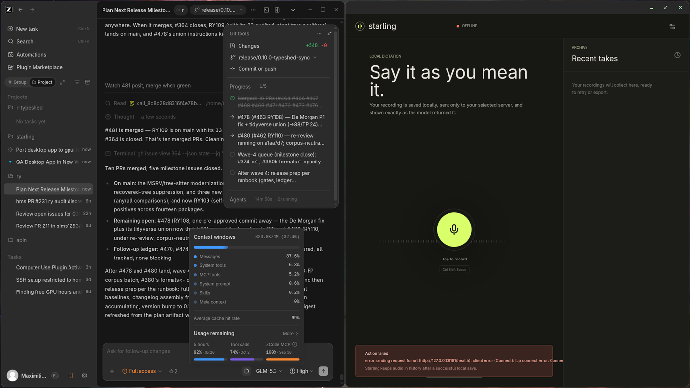

# Starling desktop — gpui

The Starling desktop app, built natively in Rust with
[Zed's gpui](https://github.com/zed-industries/zed/tree/main/crates/gpui)
(crates.io `gpui 0.2.2`). It began as a port of the former Electron desktop
app (`apps/desktop`, now removed) and is the only desktop app in the tree.
[COMPARISON.md](COMPARISON.md) records the measurements taken while both apps
existed; [PORT.md](PORT.md) documents the ported behavior contract and the
module map back to the removed TypeScript sources.



## Packaging

[Experimental releases](https://github.com/sims1253/starling/releases?q=experimental&expanded=true)
include Linux and Windows desktop archives after each successful master build,
alongside CPU, Vulkan, and CUDA server packages. See the
[installation guide](../../docs/experimental-releases.md) for setup and runtime
requirements. The desktop app connects to the server; choose the server package
for the inference backend you want to test.

`scripts/package-macos.sh` builds the universal (aarch64 + x86_64) binary,
assembles `Starling.app`, and produces `target/package/Starling-macOS-universal.dmg`.
CI runs it on every push (`desktop-gpui-rust.yml` `build-macos`).
`package-desktop.yml` builds the portable Linux and Windows archives. These artifacts are unsigned
development builds; notarized installers are a separate release task.

## Layout

- `crates/dictation` (`starling-dictation`) — logic + IO, no UI: WAV prep
  (PCM16 16 kHz mono, byte-faithful port of `@starling/dictation`'s audio
  module), the transcription HTTP client (the `/v1` batch API, mirrors
  the Electron native request path), a file-backed session store replacing
  IndexedDB (same manifest schema), settings persistence replacing
  `localStorage`, the fidelity analyzer, an FFT for the live waveform, cpal mic
  capture, and rodio playback. 81 unit tests.
- `crates/app` (`starling-gpui`) — the gpui app: topbar/connection indicator,
  capture pane with 52-bar waveform + record button, history column, transcript
  drawer with fidelity warnings, settings modal, in-app + global hotkeys,
  diagnostics hook.
- `GPUI_NOTES.md` — verified gpui 0.2.2 API cheat-sheet used to build the UI.

## Run

The machine's `rustup` shims misresolve argv[0] under some shells; invoke cargo
through the toolchain path if `cargo --version` errors:

```bash
export PATH="$HOME/.rustup/toolchains/stable-x86_64-unknown-linux-gnu/bin:$PATH"
cd apps/desktop-gpui

cargo run -p starling-gpui --release   # the app
cargo test -p starling-dictation       # logic tests
STARLING_DIAGNOSTICS=1 cargo run -p starling-gpui --release  # startup + RSS on first frame
```

Linux needs a Wayland or X11 session, Vulkan loader, fontconfig, and a
PipeWire/PulseAudio microphone source for recording.

Data locations (both created on demand):

- sessions: `~/.local/share/starling-gpui/sessions/<uuid>/{manifest.json,recording.wav}`
- settings: `~/.config/starling-gpui/settings.json`

The app uses `GET /v1/models`, streams live recording chunks through
`WS /stream`, and falls back to multipart `POST /v1/audio/transcriptions`
if the stream fails. Start the
native server from a checkout with built binaries (the Python serving path is
deprecated):

```bash
build-cpu/starling-serve --model ark \
  --gguf models/ark-asr-0.6b-bf16-exact.gguf   # binds 127.0.0.1:8181
```

The model list supplies the topbar's model name. Batch transcription returns
`{text}` and echoes a request ID in the response header.

## Staging panel

In a staged mode (every built-in mode), the take's transcript appears in an
editable draft under the recorder while you speak (#297). Grey italic words
are the live tail and may still change; the server marks older words stable
(`stable_words` on `/stream` partials) and they become final. Anything you
type or delete is yours: live updates never overwrite it, and later speech
lands after your edit. Once the take is saved, the edited text is its head
(what Copy and Export use) and is written shortly after you stop typing; the
raw transcript stays in history and "Back to raw" restores it. A processing
result shows up next to the draft as a proposal with its time, never inside
it; "Use processed" is one undo step.

Keys inside the draft: Ctrl+Backspace deletes a word, Ctrl+Shift+K a visual
line, Ctrl+Left/Right jump by word, Home/End/Up/Down move by visual line,
Ctrl+Z / Ctrl+Shift+Z undo and redo, Ctrl+Enter is Done, Escape leaves the
draft (Cmd instead of Ctrl for the Secondary keys on macOS). The recording
shortcut keeps working while the draft has focus.

Edits made while recording live in memory until the take is saved (the
audio is journaled as always). Inserting into another app is #221; for now
the draft's delivery is Copy.

## Hotkeys

`Cmd/Ctrl+Shift+Space` toggles recording — focused (in-app action) and
system-wide (`global-hotkey`; on Wayland this is portal/compositor dependent
and degrades to a console warning, mirroring the Electron fallback).
