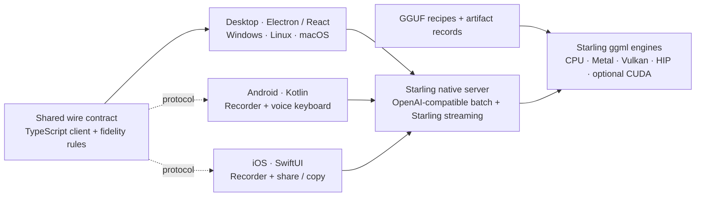
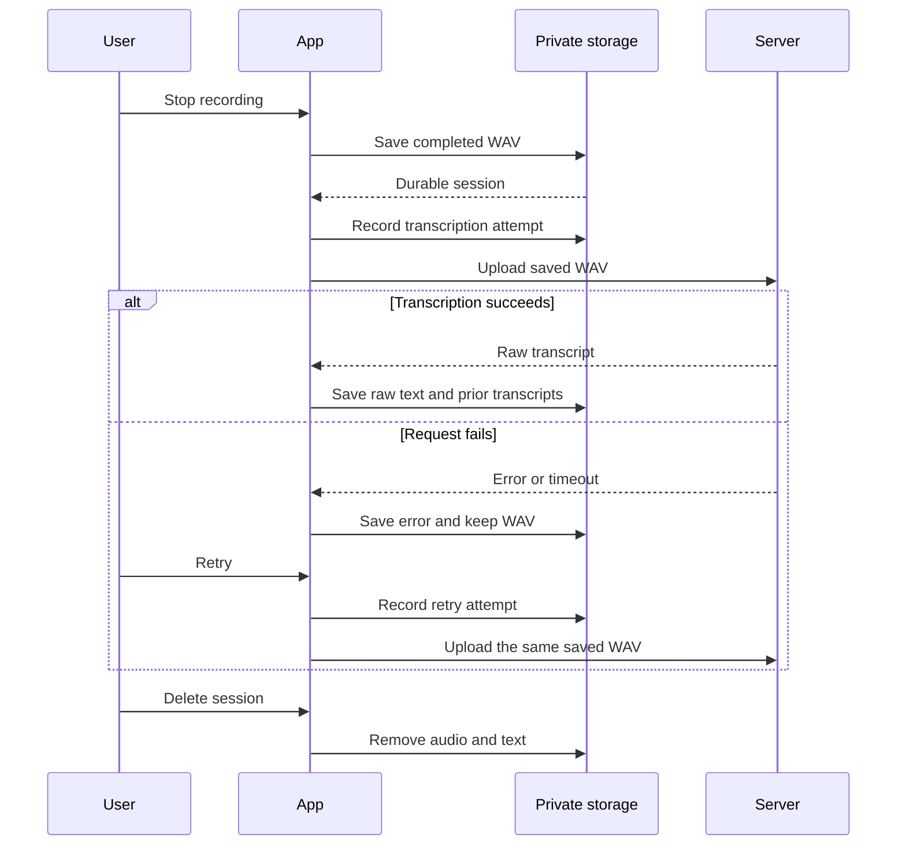

# Starling monorepo

Starling is a native speech engine, a portable serving API, and a set of clients.
CPU is the baseline. Platform accelerators are optional implementations behind
the same native engine boundary. The NVIDIA-only Python/CUDA service is deprecated.

## Components

Each build system owns its natural boundary. npm workspaces link the desktop
interface and TypeScript library. CMake owns the native server and quantizer.
Gradle owns Android. XcodeGen and Swift Package Manager own iOS. The small Python
quant catalog is independent of the deprecated Python inference environment.

| Path | Ownership |
| --- | --- |
| `apps/desktop` | Desktop UI, microphone capture, local history, native HTTP bridge, global shortcut |
| `apps/mobile` | Android activity, recorder, private storage, network client, voice keyboard |
| `apps/ios` | iOS recorder, private history, native HTTP client, share/copy |
| `packages/dictation` | WAV preparation, TypeScript client, immutable analysis, browser session persistence |
| `packages/contracts` | Language-independent OpenAPI contract |
| `backends/native` | Native CMake build definition and real HTTP contract tests |
| `quants` | Recipe catalog, calibrated recipes, artifact provenance CLI |
| `backends/python` | Deprecated service entry point and migration notes |
| `cpp`, `src/starling`, `scripts`, `benchmarks` | Existing engine source, reference kernels, converters, evaluation harnesses |

The root `CMakeLists.txt` forwards to `backends/native`. It preserves existing
build commands and binary output locations. Native source stays in `cpp/` to
preserve C API consumers and harness paths. The root `pyproject.toml` and
`uv.lock` remain the reference Python environment. Quant recipes have moved to
`quants/recipes`; historical measurement JSON retains its original provenance.

## Platform targets

| Target | Implementation | Verification needed on hardware |
| --- | --- | --- |
| Windows | Electron desktop + native CPU server | Microphone permissions, shortcut, installer |
| Linux | Electron desktop + native CPU/Vulkan server | Chromium audio, X11/Wayland shortcut behavior, packaging |
| macOS | Electron desktop + native CPU/Metal server | Microphone prompt, global shortcut, signing and notarization |
| Android | Native Kotlin recorder and voice keyboard | Microphone/device lifecycle, IME behavior, LAN connectivity |
| iOS / iPadOS | Native SwiftUI recorder | Microphone interruptions, local-network prompt, audio routes, signing |

These are development targets, not five published store releases. The CI
workflow builds the desktop app on three OS runners, builds Android, and builds
iOS for the simulator. Physical-device recording and distribution remain
separate acceptance checks. A CI configuration is not evidence of a successful
run until that workflow executes.

Apps connect to a server you start yourself. They do not bundle models or start
an inference sidecar yet. On a phone, `localhost` means the phone; use your
computer's reachable endpoint or a development tunnel. HTTP on a trusted LAN
requires explicit mobile opt-in. Production remote access belongs behind an
authenticated HTTPS proxy.

Android implements an explicit Insert action in its voice keyboard. iOS ships
a standalone recorder with share/copy, not a keyboard extension with microphone
access. Desktop exposes copy/export; cross-application text insertion is a
separate platform integration.

## Fidelity requirements

The save completes before the app sends audio to a server. A network failure
changes the session status but does not remove the WAV.

1. Keep the raw recognition text. Any future cleanup result is a separate,
   explicitly reviewed edit.
2. Preserve list numbers, negations, domain terms, corrections, short answers,
   and deliberate words such as "like". Do not treat a one-letter answer as noise.
3. Persist completed audio before requesting transcription. Keep it through
   errors, retry, and text export; deleting a recording must be explicit.
4. Show failures. An empty transcript is a result to review, not evidence of silence.
5. Do not claim vocabulary biasing unless the chosen engine implements it.
6. Keep reported audio duration separate from recognized content coverage.
   Segment boundaries often describe chunks, not word-level coverage.

Desktop recording currently buffers active capture in memory until Stop; a crash
before capture is saved can lose that active take. Browser storage can be cleared
or evicted. Native mobile recording writes audio into app-private files. None of
these paths promises recovery from every OS or storage failure. Use saved audio
exports for recordings that must outlive the app.

The text fixtures cover the six failure modes raised in the original request.
They test preservation and recovery behavior, not real-world recognition
accuracy. Release evaluation still needs real audio containing these cases,
including a ten-minute session with short answers and interrupted uploads.

## Design references

These projects inform the architecture and interaction design. Their code is
not copied into the apps or substituted for Starling's own engine.

| Reference | Design question |
| --- | --- |
| [FluidVoice](https://github.com/altic-dev/FluidVoice), [Handy](https://github.com/cjpais/handy), [Freestyle](https://github.com/sims1253/freestyle/tree/dev), [Hex](https://github.com/anomalyco/hex) | How can desktop capture, shortcuts, preview, and recovery feel immediate? |
| [Android Transcribe](https://github.com/notune/android_transcribe_app), [FUTO Voice Input](https://github.com/futo-org/voice-input) | How should recorder and voice-keyboard workflows differ? |
| [transcribe-rs](https://github.com/cjpais/transcribe-rs), [transcribe.cpp](https://github.com/handy-computer/transcribe.cpp) | How should model and hardware implementations share a stable interface? |
| [llamafile](https://github.com/mozilla-ai/llamafile) | How can native serving and model distribution become easier to install? |
| [handy-keys](https://github.com/handy-computer/handy-keys) | How should shortcuts behave across platform constraints? |
| [Wispr Flow](https://wisprflow.ai/), [Monologue](https://www.monologue.to/) | Where do polished dictation workflows help, and where can automatic edits undermine trust? |

## Next product milestones

- Bundle and supervise a local server, with model installation and verified
  artifacts, so desktop setup does not require a terminal.
- Add recording checkpoints and durable native desktop storage for recovery
  during long captures, plus explicit retention limits and disk-space handling.
- Evaluate real audio for the six fidelity cases across models and quants.
- Add capability-backed vocabulary biasing and reviewable cleanup proposals.
- Implement and test platform-specific insertion, overlays, and phone handoff.
- Produce signed installers, Android distribution builds, and iOS device builds.
