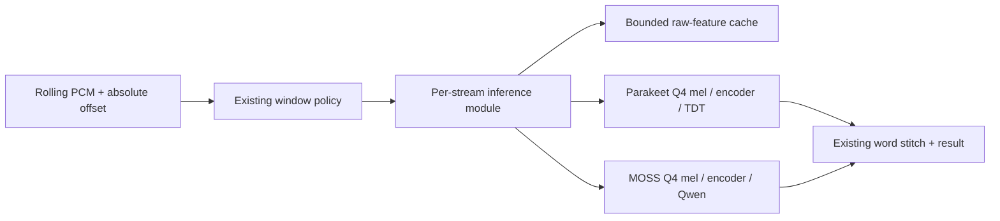

# Parakeet and MOSS Q4 inference engine draft

Status: Parakeet CPU proof of concept plus MOSS design, 2026-09-24. The
[independent Parakeet engine](../benchmarks/poc_q4_cpu/README.md) now runs a
Q4_K_M GGUF from WAV to text without ggml and compares against the ggml CPU
path. Its model-side overlap mel cache is implemented and exact on the tested
12 s / 3 s overlap. MOSS and serving integration remain design work.

## Decision

Build a separate, CPU-first inference runtime for Parakeet TDT and MOSS
Transcribe. The candidate owns GGUF reading, quantized math, model operations,
and per-stream state. Keep the public transcription result contract so the
candidate can be compared with the existing ggml implementation on identical
audio. The stream interface should hide cache keys and invalidation from the
server and Android client.

The [Splash article](https://inco.ai/blog/splash/) is the design prompt: keep
the shared runtime small, specialize work by model shape, and budget memory
explicitly. Its reported speedups measure Qwen language models on Apple
silicon. They are not estimates for these ASR models or for phone energy use.
Starling's ggml model implementations provide tensor shapes, stage outputs,
and a working correctness reference. The candidate's hot paths can use direct
model-specific loops and prepacked layouts without a general tensor graph.
The first independent Parakeet CPU path is measured in the linked PoC.

## Starting point

| Area | Existing implementation | Candidate work |
| --- | --- | --- |
| Parakeet | Native mel, FastConformer, TDT decoder, per-shape replay graphs in `cpp/parakeet/` | Standalone direct CPU WAV-to-text engine and exact model-side overlap mel cache implemented; serving and Android integration pending |
| MOSS | Native Whisper mel, windowed audio encoder, Qwen decoder with device KV in `cpp/moss/` and `cpp/lib/qwen_decode.cpp` | Implement Q4_0 CPU model operations and bound per-stream and decoder state |
| Streaming | 12 s windows, 3 s overlap, partials; `cpp/serve/stream_session.cpp` and Android `ChunkStreamer.kt` each pass complete windows to the C API | Supply absolute sample positions and a stream handle to a native cache |
| Quants | Calibrated Parakeet Q4 and experimental MOSS Q4 recipes in `quants/`; GGUF artifact records carry hashes | Select measured artifacts deliberately and gate MOSS Q4 on corpus quality |
| Mobile | Android embeds the Parakeet CPU engine; MOSS is not exposed by its JNI bridge | Optimize Parakeet first; require an on-device memory and thermal gate before MOSS integration |

The current replay caches key *graph shapes*, not audio contents. They avoid
rebuilding a graph for the same length, but do not avoid recomputing an
overlapping window. The server has a one-entry exact-tail **text** result cache
for a preview followed by an identical commit. Retain that behavior.

## Proposed module interface

```cpp
// Sketch of the native interface; names and ABI are not committed yet.
struct AudioWindow {
    uint64_t first_sample;   // absolute position in this stream, 16 kHz PCM
    const float* pcm;        // window bytes remain valid for this call
    size_t sample_count;
};

class InferenceStream {
public:
    explicit InferenceStream(LoadedModel& model, size_t feature_budget_bytes);
    WindowResult transcribe(AudioWindow window); // text or an explicit error
    void reset();                                 // new take or model generation
};
```

`LoadedModel` owns immutable Q4 weights and model-specific execution plans. An
`InferenceStream` owns only state derived from one recording. The server's
`ChunkStreamer` and Android's `ChunkStreamer` keep their existing window and
word-stitch policy. Their transcribe callbacks gain the window's absolute
`first_sample`; buffer trimming changes a local offset, never that absolute
position. Batch transcription creates an ephemeral stream or calls the
current one-shot path. The native implementation may expose an opaque C
handle to JNI/server; a C ABI addition would need an ABI version bump.
Callers promise append-only audio: the same absolute sample position cannot
later contain different PCM in one stream generation. The module checks the
overlapping samples it retains and invalidates on a mismatch, rather than
answering from a cache built for different audio.

One native call remains serialized per loaded model for this first version,
matching the current C API and server queue. The module must not expose raw
encoder tensors, decoder KV pages, or a cache-hit toggle to callers. A
cache miss computes the same window through the current model path.



## What can be reused exactly

Cache **pre-normalized** log-mel frames by model generation, stream generation,
absolute sample location, frontend configuration, and frame phase. Retain only
the bounded PCM span needed to compare reused samples exactly against the
caller; 12 s of float32 PCM is about 0.73 MiB. For the default 12 s window at
100 frames/s, 128 float32 mel bins occupy about 0.59 MiB. Count both against
a byte cap and evict frames older than the oldest live overlap; do not let a
long recording grow the cache. If the configured window advance is not a
multiple of the frontend hop, miss rather than aligning by rounding.

The frontend must calculate edge frames again. The Parakeet PoC applies this
rule with byte-identical overlap PCM checks and a one-window cache. Parakeet's preemphasis and
center padding make the window start special. MOSS's reflect padding makes
both ends special. A frame is reusable only when its entire source footprint
and its frontend initial state are identical in both windows. Initial
implementation should use a conservative edge guard and prove equality with
the uncached path for each model; a false miss costs time, a false hit changes
words. Any input gap, reset, model reload, quant artifact change, frontend
setting change, or failed/cancelled window drops the stream's cache.

Normalized mel cannot simply be carried forward. Parakeet computes a mean
and variance for each mel band across the *current* window. MOSS computes a
maximum across all current frames, including its frame dropped from output,
then clamps and normalizes relative to that maximum. Recompute those window
reductions and the normalized output from cached raw frames. Cache the exact
floating-point representation and operation order accepted by parity tests;
do not switch to incremental sums if that changes rounding or transcript
tokens.

The encoder and decoder continue to run per window in version one:

- Parakeet's Conformer attention can see the whole window, and changed
  normalization changes earlier positions. A TDT predictor state after a
  partial is therefore not a valid continuation of a longer partial.
- MOSS packs 100-frame convolution chunks and attends in windows of eight
  chunks. Even if the log-mel maximum is unchanged, a shifted 9 s stream
  window changes chunk grouping relative to the new origin. Qwen's audio
  prompt length and values can change, so its KV state cannot be copied from
  the prior transcription. Keep its current per-call KV lifecycle.

This cache removes frontend work only. Encoder and decoder work may dominate
CPU time, so measure the full stream before treating frontend reuse as a power
win. Q4 matrix performance and the number of partial calls may matter more.

After version one is measured, MOSS may cache *completed* encoder attention
groups for a growing tail with the same start **only if** the mel maximum,
chunk grouping, position indices, and all group inputs are unchanged. That
would be a separate exactness-gated experiment. No cross-window decoder KV
reuse is proposed. Parakeet encoder-state reuse would require a different,
explicitly approximate streaming model or an equivalence proof.

## Q4 serving profiles

| Profile | Artifact path | Current evidence and use |
| --- | --- | --- |
| Parakeet desktop/server | Calibrated `parakeet-q4-fullimx.recipe` (Q4_0) | Measured in this repo on a Vulkan iGPU; compare against the existing Q4_K_M community GGUF on each target |
| Parakeet Android | Existing Q4_K_M import path first; calibrated Q4_0 is a candidate | Port and compare independent arm64 dot-product and optional i8mm kernels; choose with device measurements, including energy and accuracy |
| MOSS desktop/server | Provisional `moss-q4e8-fullimx.recipe` (Q4_0 linears, Q8_0 tied head); evaluate `moss-q4e4-fullimx.recipe` (Q4_0 head) for promotion | Both remain experimental in the quant catalog; the Q4 head is quality-sensitive and needs full-corpus WER before being the default |
| MOSS Android | No default yet | The Q4e4 file is about 1.39 GB before runtime buffers; load, peak RSS, latency, and thermal behavior need a physical-device gate |

Q4 is a model **artifact** choice, not a universal runtime switch. Preserve
the quant catalog's source, recipe, calibration, quantizer, and output hashes.
Reject a profile whose GGUF architecture or tensor types the selected model
cannot load. Keep the installed artifact explicit in server/JNI diagnostics;
the shape and raw-feature caches belong to that exact loaded model. Do not
promote MOSS's catalog status or make its Q4 head the serving default before
its quality gate passes.

The ggml baseline provides CPU Q4 kernels. The independent Parakeet Q4_K PoC
reads the same GGUF bytes and runs the entire model with direct Q4_K, Q6_K,
Q8_0, and F32 CPU kernels. The direct path matched ggml text and nonblank
tokens on the timed speech windows and seven of eight real speech clips; the
remaining clip differs in punctuation, as it did before these optimizations.
That eight-clip sample was insufficient as a parity gate: a later 74.35 s
stream fixture exposed one 12 s window where direct stops after “observed”
and ggml continues “Phoebe, turning away her eyes.” Passing ggml's projected
encoder output to the independent decoder restores the full phrase. Exact
AVX2 CPU component matches were found for Q4_K and Q6_K matmul, layer norm,
and SiLU on identical saved inputs. The optional `POC_REFERENCE_NUMERICS`
build combines those arithmetic orders with FP16 rounding in the first
convolution. It fixes the original 36–48 s transcript, but a 148.70 s
recording that repeats the long fixture still has a different window. The
default fast path also fails that recording's text gate. Neither path is
ready for serving integration.
On the Ryzen 9 5900X, its warm CPU
medians were 1.55× faster than ggml for a 2.5 s clip on four cores, 1.52×
faster for a 6.31 s clip on one core, and about 1.12× faster for a 12 s
window on four cores. Three separate 12 s comparisons ranged from 1.06× to
1.21×; a separate training workload makes these timings directional.
The Q4_K AVX2 kernel shares decoded weights across four frames; exact
parallel SiLU and depthwise convolution remove serial frontend and feed-forward
work. A 2×2 F32 matrix tile cut simulated L1 data misses on a short full
inference by about 21% according to Callgrind. Raw Q4 metadata kept memory
below the packed variant, which gained no
stable end-to-end speed. AArch64 integer dot-product and NEON F32 kernels are implemented, but
only their intrinsics passed an isolated cross-compilation syntax check; the
full engine has not been built on ARM. No phone parity, latency,
or power result is available.
In a later CPU-only benchmark of finalized 12 s windows, a 74.35 s recording
gave eight requests and a 143.59 s joined recording gave 16. Two alternating
process-isolated pairs put ggml/direct wall ratios at 1.12× and 0.96× for the
shorter session, and 1.15× and 1.17× for the longer. The training job still
made timing noisy. These results do not meet a 1.5× end-to-end target, and
the text mismatch makes this PoC unsuitable as a drop-in replacement.
On the repeated 148.70 s recording, an experimental vector-SiLU fast build
reached about 1.26× ggml wall time in two paired CPU-only runs with one
different window. The full reference-numerics build was 1.01× in one pair
and had one different window. These figures remain below the hoped-for
1.5–6× gain and do not measure phone energy.
MOSS Q4_0 and its 151,936-row tied head need their own independent kernels
and model artifact before comparison.

## Scheduling and memory

Keep one resident model and one in-flight inference for the first release.
Prioritize a pending final window over another speculative partial from the
same stream. If the engine is slower than capture, coalesce stale partials;
never skip a full window that the existing stitch policy must finalize.
Expose the interval and the coalesced-partial count in diagnostics so latency
and energy can be compared at the same user-visible update rate.

At model load, account for GGUF weights, prepacked layouts, execution scratch,
MOSS KV, and a reserve for the OS/app. Give the feature cache a
small fixed per-stream budget; it yields before model or final-window work.
The ggml baseline's replay-graph LRUs stay bounded and model-owned during
comparison. On Android, keep the existing memory-pressure unload and recording fallback. A MOSS JNI route
must first pass a memory admission check on real phones; file size alone is
not peak RSS.

## Verification and decision gates

1. **Frontend equivalence.** On CPU, compare cached and uncached mel tensors
   for growing tails and shifted windows at 0, 1, 3, 9, and 12 s boundaries,
   plus non-hop-aligned configurations and reset/gap cases. Include the extra
   MOSS frame used in its maximum. Compare full token/text results with the
   current native parity manifest for each Q4 artifact.
2. **Cache accounting.** Measure eligible interior frames, hits, misses,
   invalidations, peak bytes, and recomputed edge frames. A hit count alone
   does not prove a useful speedup.
3. **End-to-end value.** For batch, growing partials, 12/3 streaming, and
   commit, report model load, p50/p95 partial and final latency, CPU time,
   peak RSS, and real-time factor. Compare current one-shot path, feature
   cache enabled, and cache disabled at identical update cadence. Include
   idle time and long recordings.
4. **Phone power.** On representative arm64 devices, measure energy per
   finalized audio minute, battery drain over a fixed dictation session,
   temperature/throttling, and time to final. Repeat at matched transcript
   quality and partial cadence. A power-saving claim needs those readings;
   shorter runtime or smaller weights alone do not establish it.
5. **Quality.** Parakeet and MOSS Q4 each need corpus WER and the fidelity
   cases in `docs/monorepo.md` (negation, lists, corrections, short answers).
   Use existing exact parity gates for runtime changes; keep quant quality
   evaluation separate from implementation parity.

## Implementation order

1. **Done as a PoC:** independent GGUF v3 reader, Q4_K/Q6_K/Q8_0/F32 kernels,
   Parakeet frontend, Conformer encoder, joint, TDT decoder, and paired ggml
   CPU comparison. Full-recording transcription parity remains open.
2. **Done inside the PoC:** one-window raw mel and positional-projection
   caches with exact overlap and invalidation checks. The streaming server
   and Android callbacks still need absolute sample positions and an opaque
   stream handle before they can use this cache.
3. Wire the direct Parakeet engine and bounded stream state into the native
   C API and Android JNI, then measure whole-session latency, memory, and
   energy on phones. Recheck parity on device before selecting a default.
4. Implement MOSS's independent Q4_0 encoder and Qwen decoder after locating
   a compatible Q4 GGUF. Measure its separate quality and memory gates.
5. Consider MOSS closed-group encoder reuse only after exact component parity.

The independent Parakeet path has passed a first full-engine CPU comparison.
Device parity and power remain separate gates; CPU speed alone cannot
establish energy savings.
